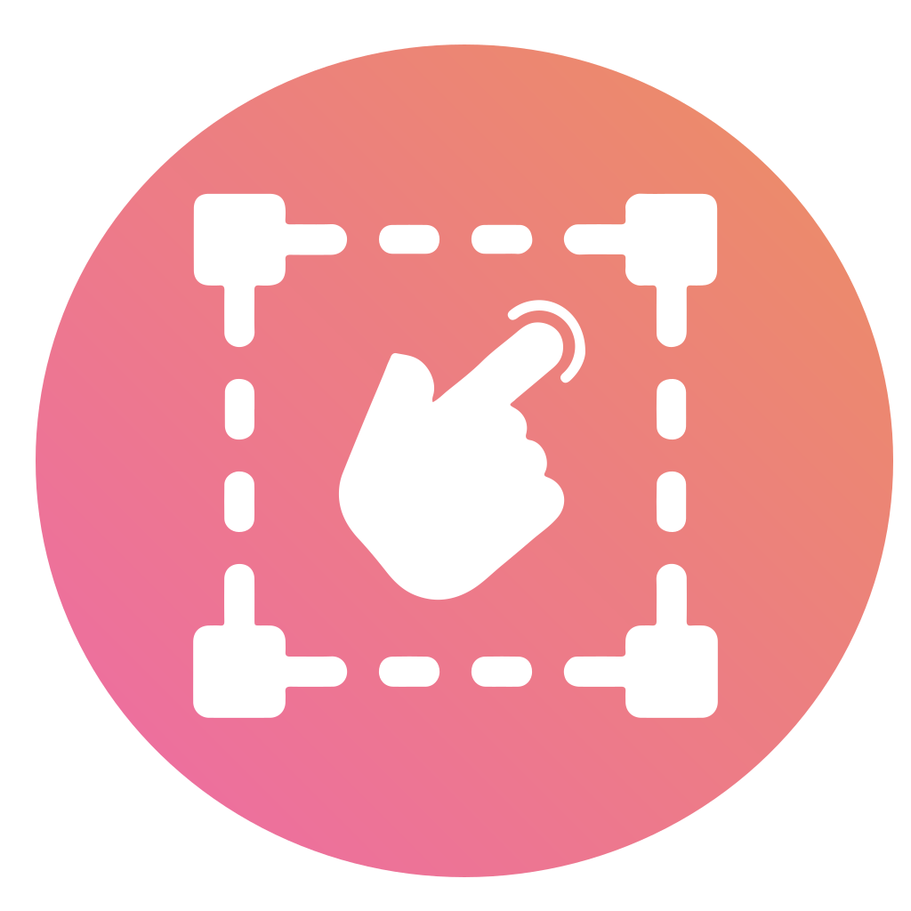

<h1 align="center">
  
</h1>

<h1 align="center">
  Slick Viewer Web Extension
</h1>

<h3 align="center">
  You can actually rotate with a mouse click sleeeeek
</h3>

You can finally pan, rotate and zoom an image without getting distracted by anything but the splendid image you are viewing!

It preserve the original browser behavior, just hold down Shift and you can drag the image on your desktop or another tab.

The extension is design to be a distraction-free mouse-only image viewer, it support some keyboard shortcuts also.

This extension is free and open source:
<https://github.com/lucacicada/slick-viewer-web-extension>

## Features

- ✔️ Rotate by click and drag on the edge of the screen
- ✔️ Rotate with the mouse wheel while holding down the right button
- ✔️ Preserve the browser drag behavior
- ✔️ Automatically hide the cursor when idling
- ✔️ Mega cool blurred background
- ✔️ Free and open source

---

### Rotate

✨*Rotate is one of the cool feature that normally you wont find!*

- 🖱️ Keep the right mouse button down + Mousewheel
- 🖱️ Left click and drag on the screen edges
- 🖱️ Hold down shift to change the rotation speed

---

### Zoom

✨*The classic zoom, that actually works!*

- 🖱️ Mousewheel, classic

---

### Pan

✨ *A fancy term to say, drag the image around!*

- 🖱️ Middle or left click anywhere on the screen

---

### Select and enlarge an area

✨*Ok you'll love this one, select an area and BOOM, you zoom in!*

- 🖱️ Right click and drag an area to zoom in

---

### Drag the image on a new tab or on your computer

*Sometimes you just want to click and drag the image on your desktop...*

- 🖱️ Shift + Left Click will preserve the original browser behavior

---

### Controls

🏖️ *Bru the keyboard, let's make good use of it!*

- ⌨️ Spacebar or Numpad0 - Reset the image

---

### Missing Features

*Sad but true, there are some missing features...*

This extension is slick and actually amazing, I can't believe you have lived without it all these years!

However, there are some feature that are missing:

- ❌ Do not work for base64 images, this is a browser limitation...
- ❌ There are no options, you cannot configure the extension... sad...
- ❌ No 1:1 ratio, there is no way to display the image at its 1 to 1 ratio...
- ❌ You cannot get rid of the blurry background... in case you have missed the point 2...
